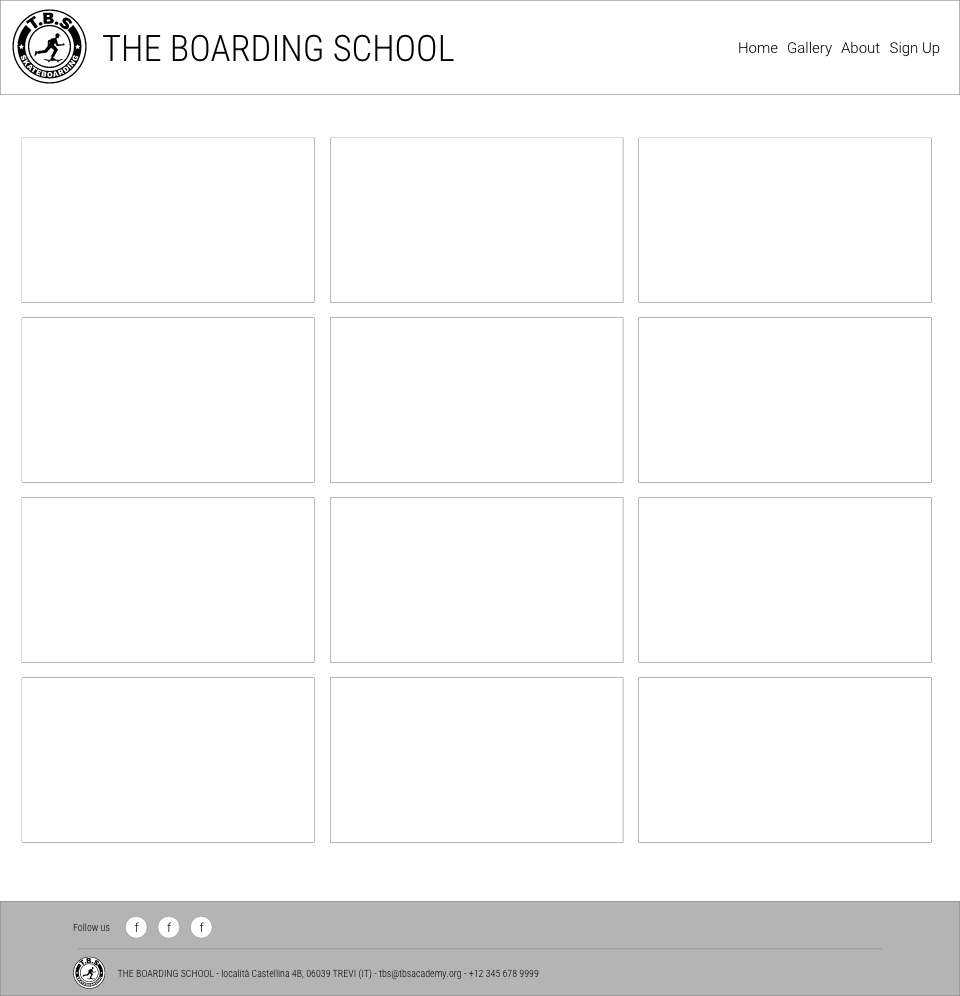

# The Boarding School Skateboards

The Boarding School (TBS skateboarding) is the website of a skateboard school specializing in longboarding. The school offers lessons and instruction on how to ride a longboard, which is a type of skateboard that is generally longer and wider than a traditional skateboard. It offers classes for beginners as well as more advanced riders, and covers topics such as balance, carving, turning, braking, and tricks. TBS aims to gather people ranging from 18 years old and older, around longboarding. It offers not only programs specialized in various disciplines of longboarding, but also opportunities for people with an interest for the skateboard culture to chat together.

## Development of the idea

### Where the idea comes from

I'm almost 50 years old and I'm passionate about skateboarding since I was 11 years old. With my age is basically impossible to skate as you wish unless you are Tony Hawk and because once you are a skater you are gonna be a skater for the rest of your life (but not your body) I thought it is a good idea to invent a skateboard school to keep this dream alive: TBS Skateboarding.

- Sketches on paper

- Logo created in Adobe Illustrator starting from the free icon I found at this link: https://www.freepik.com/free-vector/people-enjoying-their-free-time_4914715.htm#query=skateboard&position=14&from_view=search&track=sph

- Color branding research. Inspiration Screenshot and logo with color branding

- Wire framing of the website created in Adobe XD

### Features

  - __Header__

  - The header is divided in two parts, the logo, and the navigation bar. This structure is replicated in all the pages of the site in order to give the optimal user experience possible. The logo has a spin animation on load in order to give the impression that rolls as a skateboard wheel. The navigation bar permits to navigate the site back and forth without the use of the back button of the browser.
  - This section is fully responsive and adapts to different screens sizes, changing the position of the elements accordingly to the screen aspect ratios.

- __Homepage image__

  - The image hopes to transmit the right vibe to the user and includes an overlay claim that pops to the eyes.

- __School Offer__
  
  - In this section the offer of the school is displayed by images with a brief description. In the future every section will be clickable and will bring the user to the page where every discipline is described in depth with a small demostrative video with basic tutorials to move the first steps into longboarding.

- __Footer__

  - The footer is divided in the upper part and the bottom part. The first one contains the links to the most relevant social networks of the school. Each link will open in a new tab to facilitate the user's navigation, while the address and contacts of TBS are included in the bottom part.

- __Gallery page__

  - The gallery show some picture of a longboarding competition

- __About page__

  - This section tells the story of TBS and how the members fell in love for skateboarding. It features an original old slide from 1992 picturing the founders at a very young age

- __SignUp page__

  - Through the form the user can subscribe to the TBS comunity in order to get informations and news. This section is only for demostration and the backend is not implemented

## Testing 

The website has been tested in all his parts and works as intended. It is fully responsive and supports all screen sizes down to 390px. The test where conducted using the inspector of google chrome.
It scored high results with Lighthouse both on [Desktop](readme_images/lighthouse_desktop_results.png) and [Mobile](readme_images/lighthouse_mobile_results.png) ([Screenshot_Mobile](readme_images/lighthouse_mobile_test_scrshot.png)).
The elements adapt and change their appearence accordingly to the aspect ratio of the screen without breaking the design.

### Validator Testing 

- HTML
  - No errors were returned when passing through the official [W3C validator](readme_images/w3c_html-validator_scrshot.png)
- CSS
  - No errors were found when passing through the official [W3C CSS validator](readme_images/w3c_css-validator_scrshot.png)

## Deployment

- The site was deployed to GitHub pages. The steps to deploy are as follows: 
  - In the GitHub repository, navigate to the Settings tab 
  - On the right menu click on pages
  - On Build and Deployment section select the main branch and click on save
  - Once saved the url of the page will appear on top of the page 

The live link can be found here - https://fabi8bit.github.io/theboardingschool/

## Credits 

The photos on this web-site are extracted from my private photo collection except for the [free_style](assets/images/freestyle-thumb-small.jpg) and [move_around](assets/images/move-thumb-small.jpg) photos, which are available for free download from [pexels](https://www.pexels.com/search/longboard/).

### Content and technique

- All the text are invented and created from scratch
- Advises on how to use flex-box where taken from this [tutorial](https://www.youtube.com/watch?v=fYq5PXgSsbE&t=17s)
- The technique for reordering nav menu was taken from stackoverflow [here](https://stackoverflow.com/questions/11243002/css-float-right-without-changing-order)
- The technique for the spinning logo was taken from [here](https://codepen.io/teerapuch/pen/vLJXeR)
- Advises to create the photo gallery were taken from [here](https://blog.logrocket.com/responsive-image-gallery-css-flexbox/)
- The icons in the footer were taken from [Font Awesome](https://fontawesome.com/)

